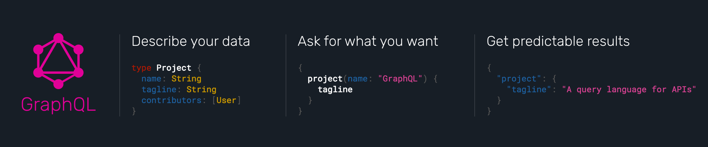
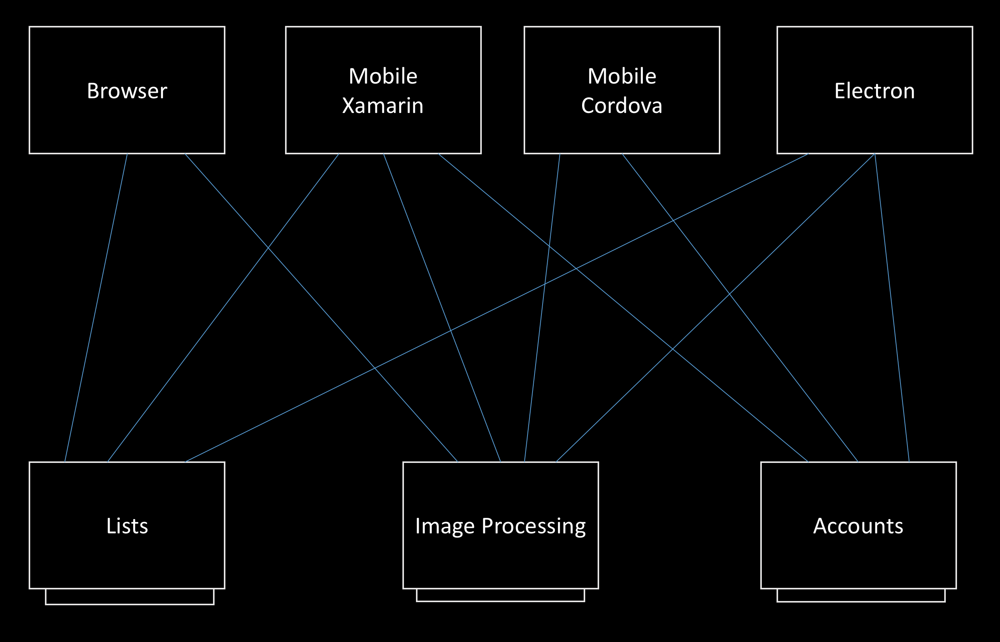
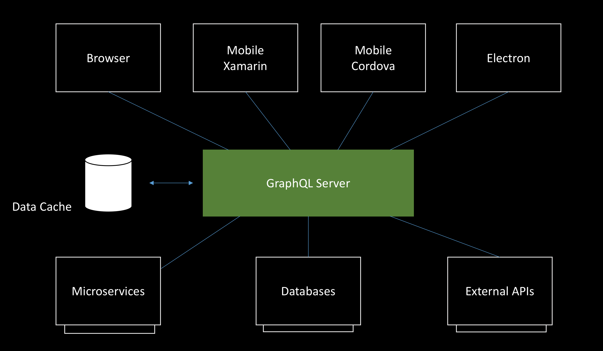

# GraphQL, the future of REST API's



> GraphQL is official released by facebook.

---

## Problems of REST API

* Starts simple and pure but outgrow itself quickly
<!-- .element: class="fragment" data-fragment-index="1" -->

* Over fetching as API requirements grow
<!-- .element: class="fragment" data-fragment-index="2" -->

* Multiple round trips to render single views
<!-- .element: class="fragment" data-fragment-index="3" -->

* Documentation is none existing or outdated
<!-- .element: class="fragment" data-fragment-index="4" -->

----

<!-- .slide: data-transition="none" -->
### The complexity of REST architecture



---

## GraphQL solves many of the REST problems

* There is no under or over fetching. You get what you ask.
* No more multiple round trips
* Versioning made easy.
* It's strongly-typed, self-documenting & has introspection

----

<!-- .slide: data-transition="none" -->
### The simplicity of GraphQL



----

## It's more then a hype

* Used at facebook for more then 4 year, recently release as open source.
* Used at Twitter, GitHub, Pintrest, Financial Times, Thomas Cook Group, and many more.
* Backend as a service ([Reindex](https://www.reindex.io/), [Scaphold](https://scaphold.io/#/))
* GraphQL endpoint for: WordPress/Drupal, GitHub, PostgreSQL, Rethinkdb
* Available in many languages and frameworks (JS, .NET, Ruby, ...)

----

## In the words of the GitHub platform team:

> GraphQL represents a massive leap forward for API development. Type safety,
> introspection, generated documentation, and predictable responses benefit
> both the maintainers and consumers of our platform. We’re looking forward to
> our new era of a GraphQL-backed platform, and we hope that you do, too!

---

# The GraphQL query language

> GraphQL queries look a lot like JSON objects without data.

----

### My first query

```
    query {
        me {
            name
        }
    }
```

<!-- .element: class="fragment" data-fragment-index="1" -->

```
    // JSON result
    data: {
        me: {
            name: "Peter"
        }
    }
```

<!-- .element: class="fragment" data-fragment-index="2" -->

----

### Query with field argument

```
    query {
        user(id: 1234) {        <-- field argument
            id
            name
        }
    }
```

```
    // JSON result
    data: {
        user: {
            id: 1234,
            name: "Peter"
        }
    }
```

----

### Query with complex field

```
    query {
        me {
            name
            profilePicture {
                width
                height
                url
            }
        }
    }
```

```
    // JSON result
    data: {
        me: {
            name: "Peter",
            profilePicture {
                "width": 50,
                "height": 50,
                "url": "https://cdn/some.jpg"
            }
        }
    }
```

----

### Query with size field argument

```
    query {
        me {
            name
            profilePicture(size: 3000) {
                width
                height
                url
            }
        }
    }
```

----

### Query with aliases

```
    query {
        me {
            name
            thumbnail: profilePicture(size: 50) {
                url
            }
            profilePicture(size: 3000) {
                width
                url
            }
        }
    }
```

```
    // JSON result
    data: {
        me {
            name: "Peter",
            thumbnail {
                url: "https://cdn/50.jpg"
            },
            profilePicture {
                width: 3000,
                url: "https://cdn/3000.jpg"
            }
        }
    }
```

----

### Query with variables

```
    query {
        users(id: 1) {
            name
        }
    }
```
<!-- .element: class="fragment" data-fragment-index="1" -->

```
    query findUser($userId: String!) {
        users(id: $userId) {
            name
        }
    }
```
<!-- .element: class="fragment" data-fragment-index="2" -->

```
    // variables
    {
        userId: 1
    }
```
<!-- .element: class="fragment" data-fragment-index="3" -->

----

### Query with relations/joins

```
    {
        me {
            name
            friends {
                name
            }
        }
    }
```

```
    // JSON result
    data: {
        me: {
            name: "Peter",
            friends: [
                { name: "bob" },
                { name: "jan" },
            ]
        }
    }
```

----

### Query with paging and filtering

```
    {
        me {
            name
            friends(orderby: IMPORTANCE, first: 1) {
                name
                events(first: 10) {
                    name
                }
            }
        }
    }
```

----

### Query Fragments

```
    query {
        lee: user(id: "1") {
            ...UserFragment
        }
        sam: user(id: "2") {
            ...UserFragment
        }
    }

    fragment UserFragment on User {
        name
        email
    }
```

---

# GraphQL mutation

> Mutation is like an action in Redux

----

## Simple mutation

```
    // query
    query {
        article(id: 1234) {
            name
            status
        }
    }
```

```
    // mutation
    mutation {
        deleteArticle(id: 1234) {
            status
        }
    }
```

----

## Complex mutation

```
    mutation newArticle {
        createArticle(article: {
            slug: "something-new",
            title: "Something New",
            status: live,
            relatedArticles: [
                { id: 1 }
            ]
        }) {
            id
            relatedArticles {
                slug
            }
        }
    }
```

---

# Advanced GraphQL queries

----

### GraphQL Directives

```
    // @skip
    query myAwesomeQuery($latest: Boolean) {
        oldField @skip(if: $latest)
    }
```

```
    // @include
    query myAwesomeQuery($isAwesome: Boolean) {
        awesomeField @include(if: $isAwesome)
    }
```

> More directives to come:
> @defer, @stream and @live

----

### GraphQL Directives

We can use interfaces and union types

```
    query {
        user(name: 'peter') {
            name
            email
            ... on Manager {
                role
            }
            ... on Employee {
                managerName
            }
        }
    }
```

```
    data: {
        user: {
            name: "Peter",
            managerName: "Wim"
        }
    }
```

---

# GraphQL Type System

> We all love types, why not on our API's

----

## The GraphQL Schema

```
    type User {
        name: String
        profilePicture(size: Int = 50): ProfilePicture
        friends(first: Int, orderby: FriendOrderEnum): [User]
        events(first: Int): [Event]
    }

    enum FriendOrderEnum {
        FIRST_NAME,
        LAST_NAME,
        IMPORTANCE
    }

    type ProfilePicture {
        height: Int,
        width: Int,
        url: String
    }

    type Event {
        name: String
        attendees(first: Int): [User]
    }

    type Query {
        user (id: Int): User
        users(first: Int): [User]
    }
```

----

### We can query the types

```
    {
        __schema {
            queryType { name }
            types {
                name
                    fields {
                        name
                        type {
                            kind
                            name
                            ofType { name }
                        }
                    }
                }
            }
        }
    }
```

---

# GraphQL implementation

----

## Map code to type

```
    type User {
        name: String
        profilePicture(size: Int = 50): ProfilePicture
        friends(): [User]
    }
```

```
    // type User {
    {
        // name: String
        name(user) {
            return user.name;
        }
        // profilePicture(size: Int = 50): ProfilePicture
        profilePicture(user, { size }) {
            return getProfilePicForUser(user, size);
        }
        // friends(): [User]
        friends(user) {
            return user.friendsIDs.map(id => getUserAsync(id));
        }
    }
```

---

# What's next

----

## Help and Information

- [http://graphql.org/](http://graphql.org/)
- [graphqlweekly](https://graphqlweekly.com/)
- [learngraphql.com](https://learngraphql.com/)
- [apollo-stack](https://medium.com/apollo-stack)
- [awesome-graphql](https://github.com/chentsulin/awesome-graphql)

----

## Try-out

The Star Wars Graphql API

[http://graphql-swapi.parseapp.com/](http://graphql-swapi.parseapp.com/)

The GitHub API

[https://graphql-explorer.githubapp.com](https://graphql-explorer.githubapp.com)

----

## Upcoming Events
- http://graphql.org/community/upcoming-events/

----

# Your next API in GraphQL
